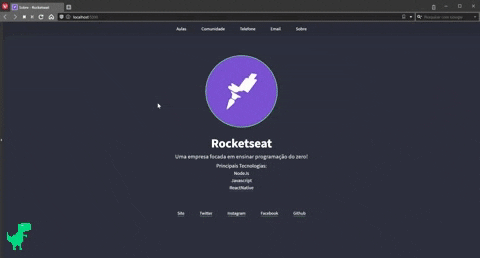

<h1 align='center' >
  
</h1>

<h1 align= 'center'>
  
</h1>

## 📝Sobre

O projeto é um **Portfolio** que foi criado no curso **LaunchBase** com a intenção de colocar em prática todo conteúdo estudado as aulas de back e front-end.

---
## 🚀Tecnologias utilizadas

  O projeto foi desenvolvido utilizando as seguintes tecnologias:

  - HTML
  - CSS
  - Javascript

---
## 📦Como baixar o projeto

```bash

  $ git clone https://github.com/matheus5dev/portfolio.git

```

---
Desenvolvido por Matheus Lopes 😎
